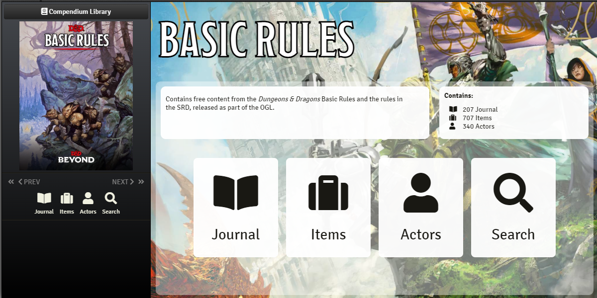

# Forge Compendium Library

Browse your compendium books like they were meant to be viewed.
[The Forge](https://forge-vtt.com)'s Compendium Library lets you navigate your D&D Beyond imported books in a beautiful and easy to use interface!

D&D Beyond converted books (since converter version 0.2.0) will automatically be handled by the browser.

For more information, visit the [Forge's documentation](https://forums.forge-vtt.com/docs?topic=17791)

## Development

In order to run this module in your local Forge dev environment, clone the repository into your `/workspace/dev-local/data` directory. Then symlink it into your bazaar `/workspace/dev-local/data/bazaar/modules/forge-compendium-browser`.

You should be able to "install" the package in the bazaar and then it will be available in-game.

### Building

Use `npm run umd` to build the module.